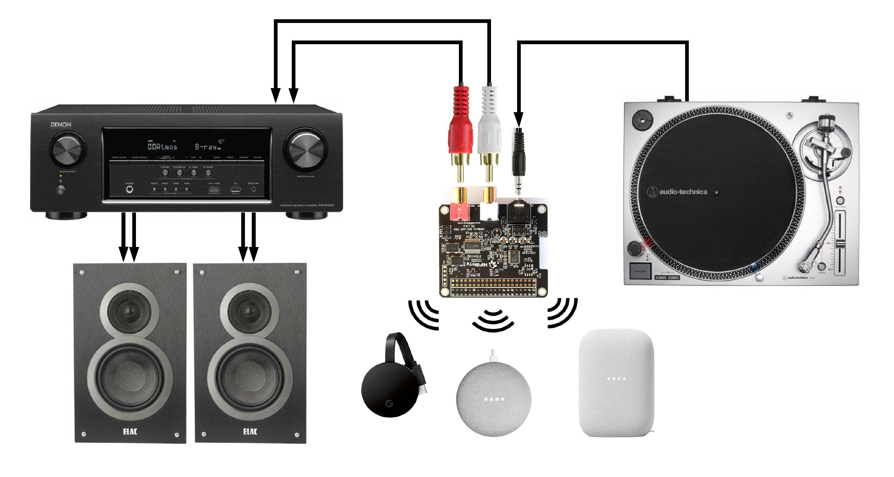

# rpi-cast

A tool to automatically cast audio input from a Raspberry Pi.

## Overview

This tool will:

1. Listen on the defined PulseAudio source (eg. a HiFiBerry DAC+ ADC 3.5mm jack) (`-i, --input-source`)
2. Upon detecting enough volume (amplitude) (`-vt, --volume-threshold`):
    1. Create a loopback for each defined PulseAudio loopback sink (eg. the HiFiBerry DAC+ ADC RCA jacks) (`-l, --loopback-sink`)
    2. Cast to the Chromecast device defined (`-d, --device-name`) or the first one found, with the defined bitrate (`-b, --bitrate`) and sample rate (`-s, --sample-rate`)
    3. Set the volume for each output sink (`-v, --volume`)
    4. Attempt to keep the cast as long as the silence timeout isn't met (`-st, --silence-timeout`)
3. Rinse, repeat!

Here's an example wiring diagram of how a [HiFiBerry DAC+ ADC Pro](https://www.hifiberry.com/shop/boards/hifiberry-dac-adc-pro/) can be used to cast audio from a turntable, as well as loopback output to a receiver:



## Dependencies

This script assumes you have a typical Raspbian install with `apt` and normal tools. It will install everything else it needs to run.

## Installation

```shell
wget https://raw.githubusercontent.com/emmercm/rpi-cast/main/rpi-cast && chmod +x rpi-cast
```

## Usage

```text
Usage: ./rpi-cast [OPTIONS]

Cast options:
  -d, --device-name string         Chromecast device name (eg. "Living Room TV")
                                   Default: the first device found, preferring
                                    groups over single devices

  -v, --volume number              Output volume percentage (can can exceed 100)
                                   Default: 100

  -st, --silence-timeout number    Stop casting after some seconds of silence
                                   Default: 300

  -vt, --volume-threshold number   Minimum volume threshold to start casting
                                   Default: 0.005

Quality options:
  -b, --bitrate string             Bitrate to use in kbps
                                   Default: 320 if not WAV/FLAC

  -c, --codec string               Audio codec to use
                                   Options: mp3, ogg, aac, opus, wav, flac
                                   Default: wav

  -s, --sample-rate string         Sample rate to use in Hz
                                   Default: 96000 if AAC/WAV/FLAC, otherwise 44100

Other options:
  -h, --hifiberry-overlay string   HiFiBerry overlay to configure
                                   Optional, only needs to be done once

  -i, --input-source string        Pattern for the PulseAudio sources to use
                                   Default: alsa_input

  -l, --loopback-sink string       Pattern for the PulseAudio sinks to loopback to
                                   Default: alsa_output

HiFiBerry overlays:
  hifiberry-dacplusadc
  hifiberry-dacplusadcpro
```

### Examples

Set up the drivers for a new HiFiBerry device (only needs to be done once), and start casting to the first device found:

```shell
./rpi-cast -h 'hifiberry-dacplusadcpro'
```

Cast to the entire house:

```shell
./rpi-cast -d 'Entire House'
```

Cast to a specific Chromecast with boosted volume:

```shell
./rpi-cast -d 'Living Room TV' -v 125
```

Cast with a lossy codec to reduce bandwidth:

```shell
./rpi-cast -c mp3 -b 256
```

## Automatic startup

To have `rpi-cast` automatically start on device boot, add the following to your `/etc/rc.local` file:

```shell
# (Optional) log all /etc/rc.local output to a temp file
exec &> /tmp/rc.local.log
set -x

# Start rpi-cast and log to a temp file
su pi -c '/home/pi/rpi-cast > /tmp/rpi-cast.log &'
```
